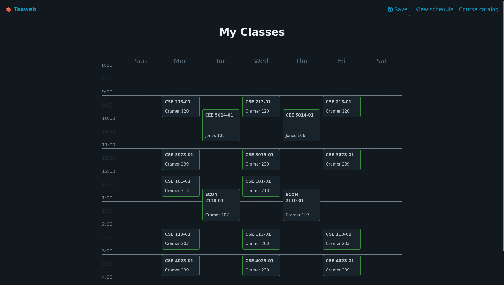

# Teaweb



Work-in-progress replacement for Benjamin Bean's Beanweb, a scheduling
program for NMT students.

Goals:

-   More modern-looking, clean web design, with dark & light theme and
    minimalism.
-   Don't make the mistake everyone seems to make of trying to stick
    classes in a table; vertical space exists for a reason.
-   Mobile layout support (eventually there might someday be an Ionic
    version of this for phones).
-   Statically type everything.
-   Don't have user accounts; instead have users create a schedule, and
    have a button that generates a permalink to that schedule.
-   Have pages for individual instructors that show the list of classes
    they're doing (with a schedule rendered for them), and if possible,
    their office hours and links to their personal web pages.
-   Try to translate class names into English: instead of saying "Intro
    to Envir. Science & Engr" (the official name of the course in
    Banweb), write "Introduction to Environmental Science &
    Engineering". Instead of saying "No Given Name Ramyaa" use her
    actual name, "Ramyaa".

Currently we're using a custom version of Beanweb's scraper to prepare
the `classtimes.json` file; I'll probably rewrite it in Typescript
soon.

## Running

This is a SvelteKit project. After cloning use:

```bash
npm i  # install dependencies, first run only
npm run dev -- --open
```
